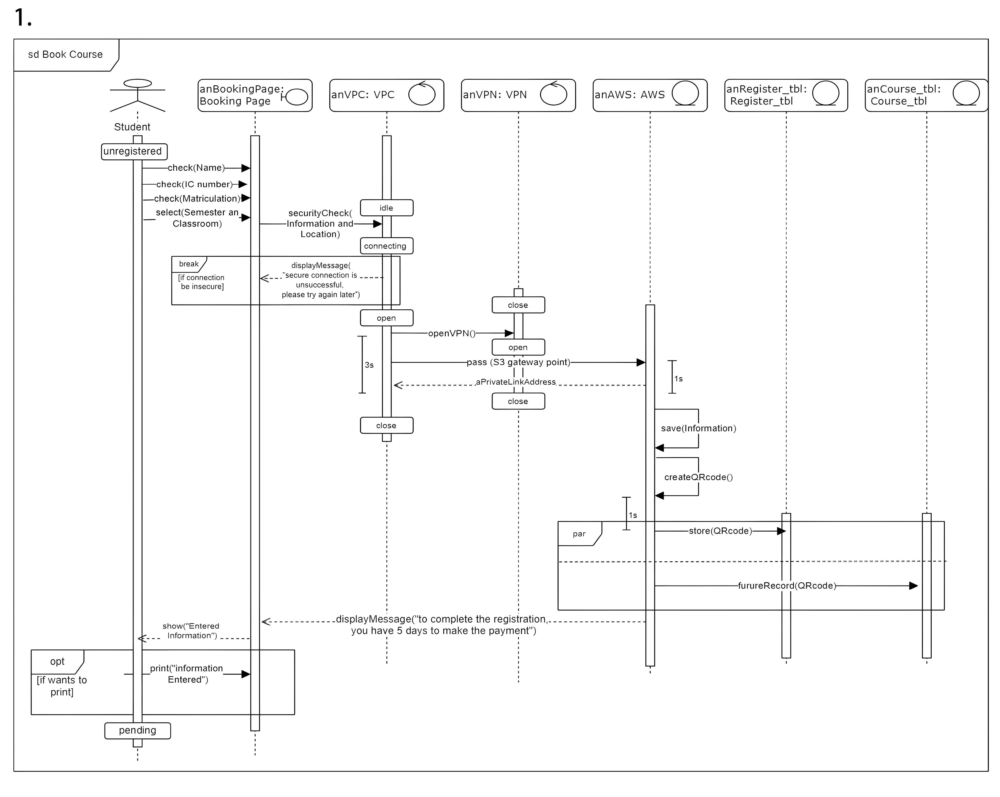
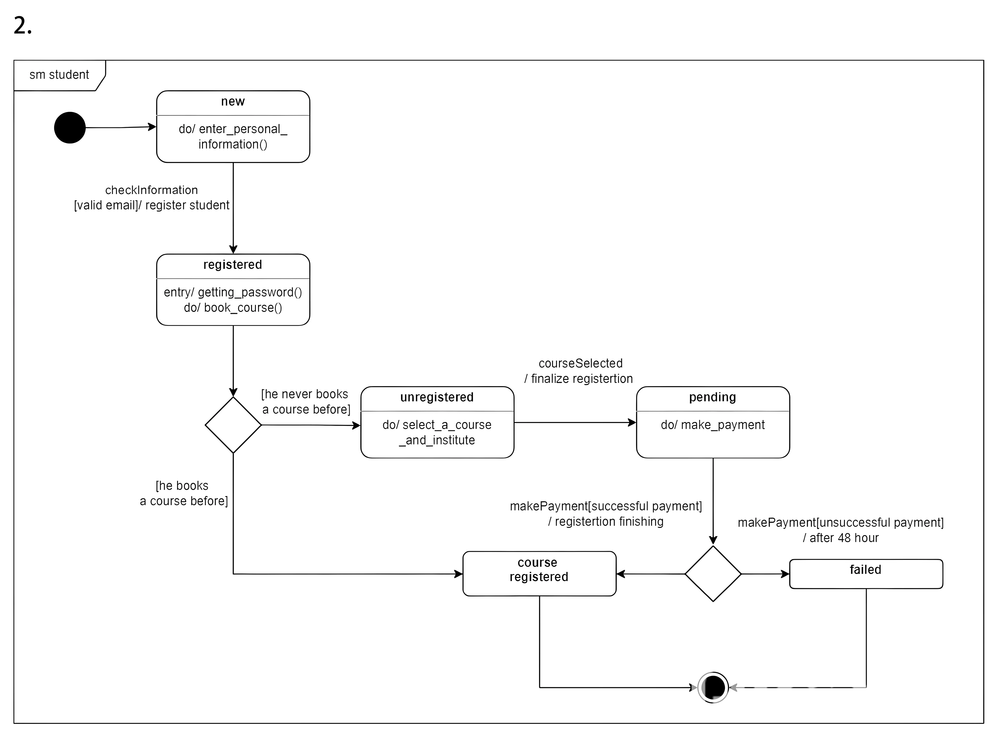

# Course Registration System Diagrams

This repository contains two UML diagrams that illustrate the flow and state transitions involved in a **Course Registration/Booking System**. The diagrams are:

1. **graph1.png** – The **Sequence Diagram**
2. **graph2.png** – The **State Machine Diagram**

Below is a detailed explanation of each diagram, along with how they fit into the overall project.

---

## 1. Sequence Diagram (graph1.png)

This **Sequence Diagram** shows the **interaction between different system components** over time. It captures how the **Student** (actor) interfaces with various services to complete the course‐booking process:

- **Student (unregistered)**: Begins the process by accessing the booking page.
- **anBookingPage: Booking Page**: Handles user input such as personal details, IC/Matric ID, and selected semester.  
  - Displays error messages if a secure connection cannot be established.
  - Moves the user forward when the checks pass.
- **anVPC: VPC** and **anVPN: VPN**: Establish a secure connection between the booking page and the cloud platform.
  - `openVPN()` is called to pass credentials or IP addresses securely.
  - If unsuccessful, the system shows an error message and stops the process.
- **anAWS: AWS**: Receives and processes the student's data once the connection is secure.
  - Saves information, creates/stores a QR code, and updates records in parallel.
- **anRegister_tbl: Register_tbl** and **anCourse_tbl: Course_tbl**:
  - Database tables (or a representation thereof) where registration info and course data are stored and retrieved.
- The diagram includes **opt** blocks for optional printing and **par** blocks for parallel operations (like storing QR codes).

At the end of this sequence, the system informs the student they have a certain number of days (e.g., 5 days) to complete the payment, transitioning them into a **pending** state.

---

## 2. State Machine Diagram (graph2.png)

This **State Machine Diagram** outlines the **lifecycle of a student’s registration status** during the course‐booking process:

1. **Initial**: The student starts in a “new” state.
2. **new** → **registered**:  
   - The system verifies provided information (e.g., valid email).  
   - If valid, the student is “registered” (the system may generate a password and allow course booking).
3. **Decision Diamond**:  
   - If the student has never booked a course before, they move to the **unregistered** state to select one.  
   - Otherwise, they may skip directly to “course registered” if they’re a returning user.
4. **unregistered** → **pending**:  
   - Once a course and institute are selected, the user finalizes registration details and moves to a pending (payment) state.
5. **pending** → **course registered** or **failed**:  
   - Payment success transitions to **course registered**.  
   - Unsuccessful payment after a time limit (e.g., 48 hours) transitions to **failed**.

This diagram highlights **how the student’s status changes** from entering personal details to finalizing the course, along with the actions performed in each state (like `do/ select_a_course_and_institute` or `do/ make_payment`).

---

## Putting It All Together

These diagrams provide two complementary views:

- **Sequence Diagram**: Shows **how** different parts of the system (Booking Page, VPN, AWS, Databases) **interact** step by step when the user attempts to book a course.
- **State Machine Diagram**: Shows **what states** the student’s registration record can take on, from “new” through “registered,” “pending,” “failed,” or successfully “course registered.”

By examining both diagrams, developers and stakeholders gain a clear understanding of the **functional flow** (Sequence) and the **lifecycle states** (State Machine) of the course registration process.

---

## Project Overview

In summary, this **Course Registration/Booking System**:

1. **Validates** student information and ensures a **secure** connection (using VPC/VPN).
2. **Registers** the student with a unique account or reuses existing credentials.
3. Allows the student to **select** courses and institutes from a database.
4. Places the student in a **pending payment** state with a deadline.
5. **Finalizes** or **fails** the registration based on payment success.

---

### Contact / Contribute

If you have any questions or want to contribute, feel free to open an issue or submit a pull request. 

**Thank you for checking out these UML diagrams!**
